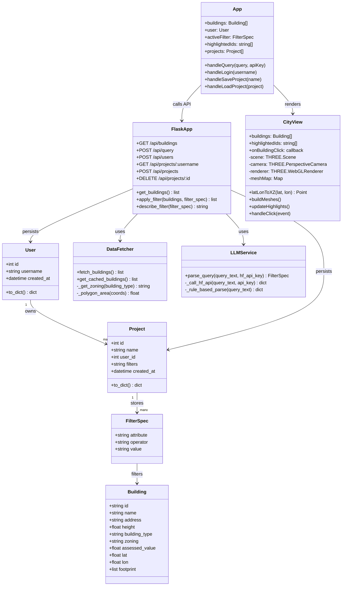
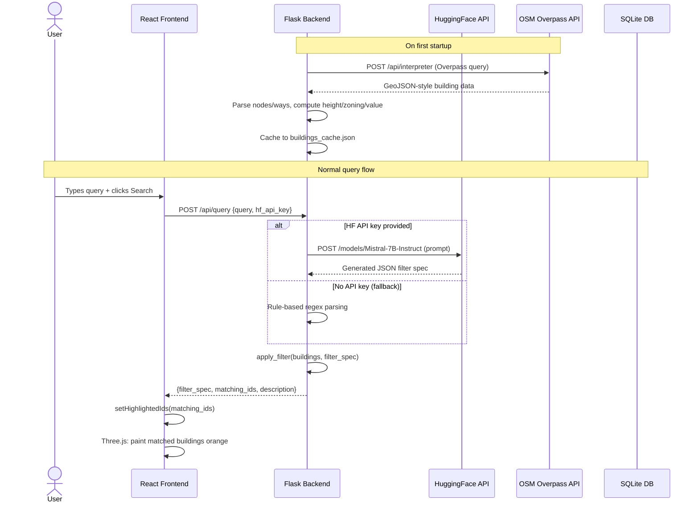
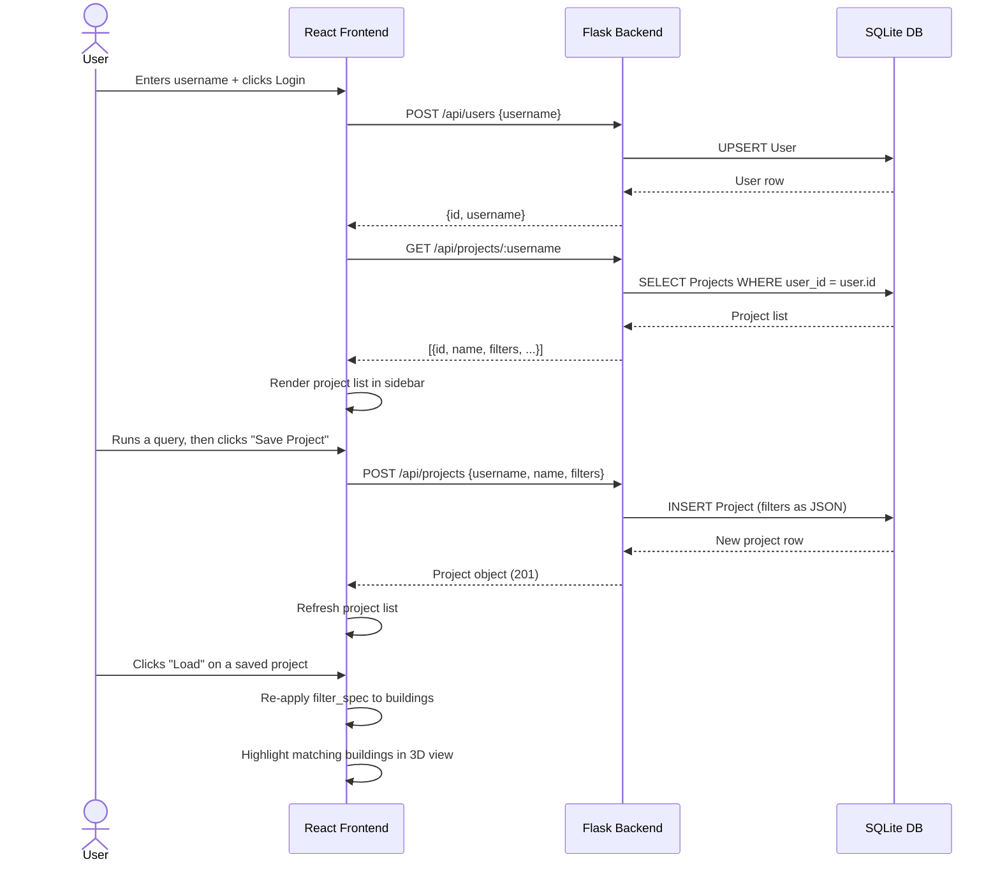

# UML Diagrams — 3D City Dashboard with LLM Querying

## Class Diagram

```mermaid
classDiagram
    class User {
        +int id
        +string username
        +datetime created_at
        +to_dict() dict
    }

    class Project {
        +int id
        +string name
        +int user_id
        +string filters
        +datetime created_at
        +to_dict() dict
    }

    class Building {
        +string id
        +string name
        +string address
        +float height
        +string building_type
        +string zoning
        +float assessed_value
        +float lat
        +float lon
        +list footprint
    }

    class FilterSpec {
        +string attribute
        +string operator
        +string value
    }

    class FlaskApp {
        +get_buildings() list
        +apply_filter(buildings, filter_spec) list
        +describe_filter(filter_spec) string
        +GET /api/buildings
        +POST /api/query
        +POST /api/users
        +GET /api/projects/:username
        +POST /api/projects
        +DELETE /api/projects/:id
    }

    class DataFetcher {
        +fetch_buildings() list
        +get_cached_buildings() list
        -_get_zoning(building_type) string
        -_polygon_area(coords) float
    }

    class LLMService {
        +parse_query(query_text, hf_api_key) FilterSpec
        -_call_hf_api(query_text, api_key) dict
        -_rule_based_parse(query_text) dict
    }

    class CityView {
        +buildings: Building[]
        +highlightedIds: string[]
        +onBuildingClick: callback
        -scene: THREE.Scene
        -camera: THREE.PerspectiveCamera
        -renderer: THREE.WebGLRenderer
        -meshMap: Map
        +latLonToXZ(lat, lon) Point
        +buildMeshes()
        +updateHighlights()
        +handleClick(event)
    }

    class App {
        +buildings: Building[]
        +user: User
        +activeFilter: FilterSpec
        +highlightedIds: string[]
        +projects: Project[]
        +handleQuery(query, apiKey)
        +handleLogin(username)
        +handleSaveProject(name)
        +handleLoadProject(project)
    }

    User "1" --> "many" Project : owns
    Project "1" --> "many" FilterSpec : stores
    FilterSpec --> Building : filters
    FlaskApp --> DataFetcher : uses
    FlaskApp --> LLMService : uses
    FlaskApp --> User : persists
    FlaskApp --> Project : persists
    App --> CityView : renders
    App --> FlaskApp : calls API
```

---

## Sequence Diagram — LLM Query Flow

```mermaid
sequenceDiagram
    actor User
    participant Frontend as React Frontend
    participant Backend as Flask Backend
    participant HF as HuggingFace API
    participant OSM as OSM Overpass API
    participant DB as SQLite DB

    Note over Backend,OSM: On first startup
    Backend->>OSM: POST /api/interpreter (Overpass query)
    OSM-->>Backend: GeoJSON-style building data
    Backend->>Backend: Parse nodes/ways, compute height/zoning/value
    Backend->>Backend: Cache to buildings_cache.json

    Note over User,DB: Normal query flow
    User->>Frontend: Types query + clicks Search
    Frontend->>Backend: POST /api/query {query, hf_api_key}

    alt HF API key provided
        Backend->>HF: POST /models/Mistral-7B-Instruct (prompt)
        HF-->>Backend: Generated JSON filter spec
    else No API key (fallback)
        Backend->>Backend: Rule-based regex parsing
    end

    Backend->>Backend: apply_filter(buildings, filter_spec)
    Backend-->>Frontend: {filter_spec, matching_ids, description}
    Frontend->>Frontend: setHighlightedIds(matching_ids)
    Frontend->>Frontend: Three.js: paint matched buildings orange
```

---

## Sequence Diagram — Project Save/Load Flow

```mermaid
sequenceDiagram
    actor User
    participant Frontend as React Frontend
    participant Backend as Flask Backend
    participant DB as SQLite DB

    User->>Frontend: Enters username + clicks Login
    Frontend->>Backend: POST /api/users {username}
    Backend->>DB: UPSERT User
    DB-->>Backend: User row
    Backend-->>Frontend: {id, username}
    Frontend->>Backend: GET /api/projects/:username
    Backend->>DB: SELECT Projects WHERE user_id = user.id
    DB-->>Backend: Project list
    Backend-->>Frontend: [{id, name, filters, ...}]
    Frontend->>Frontend: Render project list in sidebar

    User->>Frontend: Runs a query, then clicks "Save Project"
    Frontend->>Backend: POST /api/projects {username, name, filters}
    Backend->>DB: INSERT Project (filters as JSON)
    DB-->>Backend: New project row
    Backend-->>Frontend: Project object (201)
    Frontend->>Frontend: Refresh project list

    User->>Frontend: Clicks "Load" on a saved project
    Frontend->>Frontend: Re-apply filter_spec to buildings
    Frontend->>Frontend: Highlight matching buildings in 3D view
```
